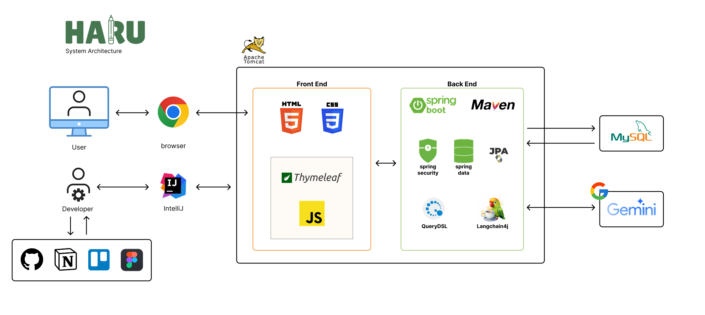
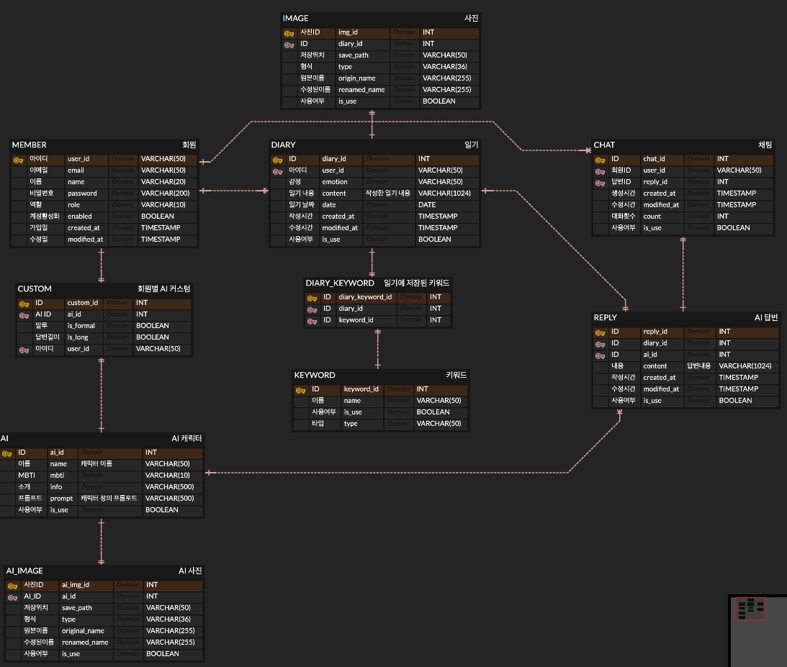

# 데브코스 5기 6회차 2차 프로젝트
## 감정일기 "HARU"

>"오늘, 당신의 하루는 어땠나요?"

"HARU"는, 일기 작성 및 AI캐릭터와의 상호작용이 가능한 웹 서비스입니다.

## 주요기능

### 일기 조회기능
- 홈화면의 캘린더에서는 일기를 작성한 날짜에 해당 날짜의 일기에서 선택한 기분 이모지를 확인할 수 있습니다.
- 홈화면의 최근일기 카드 또는 타임라인에서 작성된 일기를 카드형식으로 확인가능합니다.
- 캘린더의 날짜 클릭, 혹은 일기 카드 클릭을 통해 해당 날짜의 일기를 조회할 수 있습니다.
- 일기 조회시 해당일기에 AI가 답장을 보냈을 경우, 답장을 확인할 수 있습니다.

### 일기 작성/수정/삭제 기능
- 일기 작성시, 5개의 이모지중 오늘의 기분에 따라 선택할 수 있습니다.
- 감정, 상황, 사람과 관련된 선택가능한 키워드들이 있습니다.
- 오늘을 대표하는 한장의 사진을 추가할 수 있습니다.
- 일기의 수정 및 삭제가 가능하며, 수정된 일기에 대한 답장은 받을 수 없습니다.

### 대화기능
- 일기 조회페이지에서 AI의 답장이 있는경우 대화하기 버튼을 통해 추가적으로 캐릭터와 대화가 가능합니다.
- 작성한지 일주일이 지났거나 이미 대화한 경우, 대화는 불가능합니다.

### AI 캐릭터
- 현재 4개의 캐릭터가 존재합니다.
- 신규회원의 경우 가입시 간단한 질문들을 통해 AI캐릭터를 추천받게됩니다.
- 설정 페이지에서 캐릭터와 말투, 일기의 답변길이를 변경할 수 있습니다.

### 대시보드
- 대시보드를 통해 월간/연간 기분의 흐름, 기분 분포, 작성한 일기수, 사용한 키워드 랭킹을 확인할 수 있습니다.

## 시스템 아키텍처
- 시스템은 다음과 같은 구조로 이루어져있습니다.

- ERD 구조

- [API 명세](https://www.notion.so/HARU-APIs-1fc3d0a9892d80a0a4f8f87b884c68fb?pvs=4)

- [목업 Figma](https://www.figma.com/design/QGDpF4Wlg9it36HoKhp4Un/UI-Design?node-id=0-1&t=JSIrKBkVo2UJT1Nu-1)
